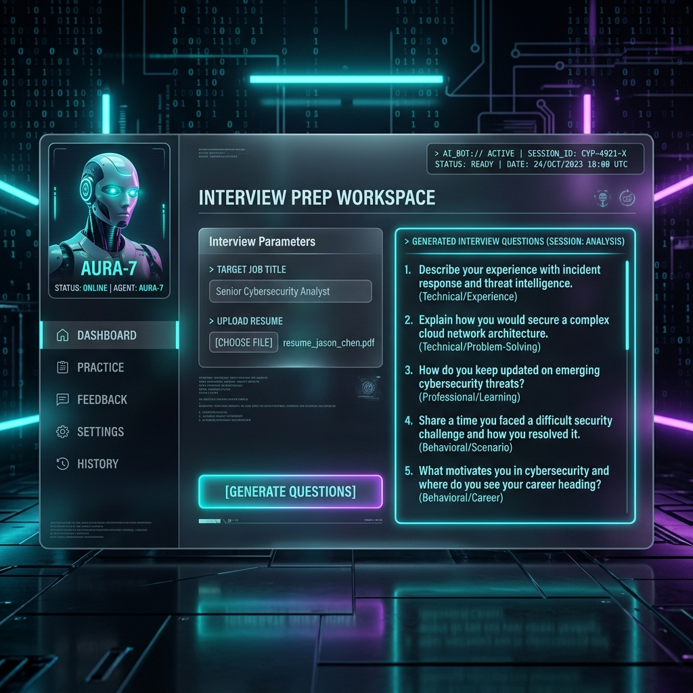
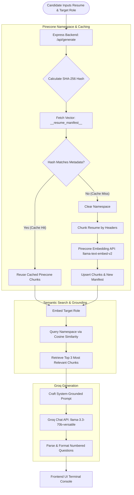

# 🧠 Smart Interview Prep Bot

[](https://nodejs.org/)
[](https://expressjs.com/)
[](https://www.pinecone.io/)
[](https://groq.com/)
[](LICENSE)
[](https://vercel.com/)
[](https://smart-interview-bot-git-main-swarnika-somvanshis-projects.vercel.app/)

An **enterprise-grade, high-performance RAG (Retrieval-Augmented Generation)** web application that creates customized, context-grounded interview questions. It maps your actual resume experiences and skills to your target job description using **Pinecone Vector Database** for semantic search and **Groq LLM** for ultra-fast, zero-cost generation.



---

## 🚀 System Architecture & RAG Pipeline

Instead of pasting your entire resume into an LLM context (which wastes tokens, causes context distraction, and increases AI hallucinations), **Smart Interview Prep Bot** uses a state-of-the-art **RAG architecture**:



---

## ✨ Key Features

* ⚡ **Zero-Cost Generation**: Utilizes Groq's high-speed API keys and Pinecone's serverless free-tier for maximum performance with **$0 hosting & inference cost**.
* 🧠 **Context-Grounded RAG**: Restricts questions purely to the resume contents found via vector similarity, minimizing hallucinations and ensuring realistic evaluation.
* ♻️ **Persistent Session Caching**: Generates SHA-256 hashes of resumes and matches them against `__resume_manifest__` inside a Pinecone namespace. If you run multiple role queries against the same resume, the app bypasses chunking and embedding entirely.
* 👾 **Cyberpunk Retro UI**: A custom, hand-crafted glassmorphic, command-line-inspired frontend with terminal status bars, active avatar animations, and interactive controls.
* 📱 **Fully Responsive Layout**: Built with custom CSS variables designed to work beautifully on mobile, tablet, and widescreen monitors.

---

## 🛠️ Tech Stack

| Component | Technology | Version / Spec |
| :--- | :--- | :--- |
| **Frontend** | Vanilla HTML5 & ES6+ Javascript | Modern DOM with native async fetch |
| **Styling** | Custom Vanilla CSS3 | Custom transitions, animations, CSS Grid & Flexbox |
| **Icons** | Lucide Icons | Latest |
| **Server** | Express.js / Node.js | v4.18+ / v18+ |
| **Vector Index** | Pinecone Database | API version `2025-10` |
| **Embeddings** | Pinecone Hosted Inference | `llama-text-embed-v2` (384-dimension, Cosine metric) |
| **LLM Model** | Groq Inference Engine | `llama-3.3-70b-versatile` |

---

## ⚙️ Configuration & Environment Variables

Create a `.env` file in the root directory. You can copy the template from `.env.example`:

```bash
# General
PORT=3000
NODE_ENV=development

# Groq Credentials
# Get your API key at: https://console.groq.com/
GROQ_API_KEY=gsk_your_groq_api_key

# Pinecone Credentials
# Sign up at: https://www.pinecone.io/
PINECONE_API_KEY=pcsk_your_pinecone_api_key
PINECONE_INDEX_NAME=smartinterviewbot-embeddings
```

---

## 🚀 Getting Started

### 📋 Prerequisites
Ensure you have the following installed on your machine:
* [Node.js (version 18 or above)](https://nodejs.org/)
* [Pinecone Account (Free Tier)](https://www.pinecone.io/)
* [Groq Cloud Account (Free Tier)](https://console.groq.com/)

### 💻 Local Installation

1. **Clone the Repository**
   ```bash
   git clone https://github.com/swarnika-cmd/SmartInterviewBot.git
   cd SmartInterviewBot
   ```

2. **Install Dependencies**
   ```bash
   npm install
   ```

3. **Configure Environment Variables**
   Create your local environment file:
   ```bash
   cp .env.example .env
   ```
   Open the `.env` file and populate it with your `GROQ_API_KEY` and `PINECONE_API_KEY`.

4. **Launch Application**
   For local development:
   ```bash
   npm run dev
   ```
   For production start:
   ```bash
   npm start
   ```

5. **Access Application**
   Open your browser to [http://localhost:3000](http://localhost:3000)

---

## 🌐 Vercel Serverless Deployment

This project is configured to run out-of-the-box as a **Vercel Serverless Application**.

### Architecture differences:
* **Local environment:** [server.js](file:///c:/Users/somva/OneDrive/Desktop/smartInterviewBot/server.js) starts a persistent Node/Express server listening on `PORT`.
* **Vercel environment:** Vercel deploys the application serverlessly using the entrypoint at [api/index.js](file:///c:/Users/somva/OneDrive/Desktop/smartInterviewBot/api/index.js), which exports the Express app instance. Vercel's CDN routes static file requests directly from the root directory for maximum speed, and rewrites `/api/*` calls to the serverless function.

### How to Deploy:

1. **Push your code to GitHub** (ensure `.env` is ignored by `.gitignore`).
2. **Connect to Vercel**:
   * Go to [vercel.com](https://vercel.com) and click **"New Project"**.
   * Import your GitHub repository.
3. **Configure Environment Variables**:
   * Under Project Settings -> **Environment Variables**, add the following keys:
     * `GROQ_API_KEY` = *[Your Groq Key]*
     * `PINECONE_API_KEY` = *[Your Pinecone Key]*
4. **Click "Deploy"**. Vercel will build your static files and compile your serverless function automatically!

---

## 📖 Deep Dives & Code Specifications

<details>
<summary>🔍 <b>RAG Implementation Details</b></summary>

### 1. Header-Based Chunking
The resume is normalized and split on section header boundaries using a regular expression:
```javascript
const sections = normalized.split(/\n(?=[A-Z][A-Z\s/&-]{2,}\n)/);
```
Chunks under 30 characters are filtered out as noise, ensuring only substantial resume components (like experiences, skills, and projects) get embedded.

### 2. Session Manifest Caching
To avoid redundant embeds, the backend fetches a manifest vector called `__resume_manifest__` from Pinecone inside the user's specific `sessionId` namespace. 
* If the `resumeHash` stored in the metadata matches the newly computed hash, the backend skips embedding and similarity updates.
* If it doesn't match, the backend clears the namespace and generates new embeddings.

> [!NOTE]
> Pinecone serverless indexes reject all-zero vectors. The manifest vector values are initialized with a non-zero element (`v[0] = 1.0`) to avoid API validation errors while preserving semantic caching.

### 3. Top-K Semantic Retrieval
The user's query (target job role) is embedded and sent to Pinecone namespace. The database returns the top 3 matches using cosine similarity scoring, which is then fed into the prompt context for LLM generation.
</details>

<details>
<summary>🔌 <b>API Endpoints</b></summary>

### POST `/api/generate`
Executes the full Pinecone RAG pipeline and returns generated questions.

**Request Body:**
```json
{
  "role": "Senior React Developer",
  "resume": "EXPERIENCE\n- Built React applications with Redux...\nSKILLS\n- React, Redux, Node.js",
  "systemPrompt": "You are a senior technical hiring manager...",
  "sessionId": "session_123456789" (optional)
}
```

**Response Body:**
```json
{
  "text": "1. Can you describe how you managed React application state using Redux?\n2. What are the performance advantages of React over other frontend libraries?",
  "sessionId": "session_123456789",
  "retrieval": {
    "reusedIndex": true,
    "chunkCount": 4
  }
}
```
</details>

<details>
<summary>🛠️ <b>Troubleshooting & Diagnostics</b></summary>

### ❌ Pinecone Configuration / Initialization Error
Ensure that `PINECONE_API_KEY` is set correctly in your environment. The server will attempt to automatically spin up a serverless index `smartinterviewbot-embeddings` in the `aws/us-east-1` region if it doesn't already exist.

### ❌ Dense vectors must contain at least one non-zero value
This indicates that the manifest vector was initialized with all zeroes. Ensure you are running the latest codebase where the manifest vector values array has a non-zero value (e.g. `v[0] = 1.0`).

### ❌ Groq API returns empty response
This usually indicates that your Groq API key is invalid or has expired, or you've exceeded the RPM limits. Verify your credentials on the [Groq Console](https://console.groq.com/).
</details>

---

## 🛡️ License

This project is licensed under the MIT License - see the [LICENSE](LICENSE) file for details.

---

> [!TIP]
> **Pro Tip:** Try querying different roles for the same resume. You'll notice the second query is significantly faster because the application reuses your existing embeddings from Pinecone storage!
